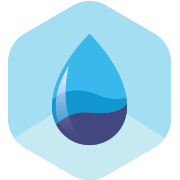

	
  <h1>
		plugin-victory-charts
	</h1>
  
Bluebase plugin for victory charts

## 🎊 Status

 

## 🤝 Compatibility

| 🌏 Web | 🖥 Electron | 📱 React Native |
| :---: | :--------: | :------------: |
|✅|✅|❌|

## Docs

- [Storybook](https://BluebaseJS.github.io/plugin-victory-charts/storybook/)
- [API Docs](https://BluebaseJS.github.io/plugin-victory-charts/)